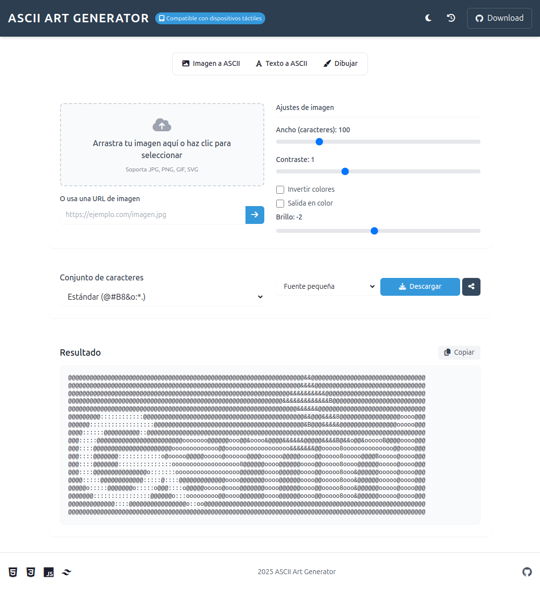
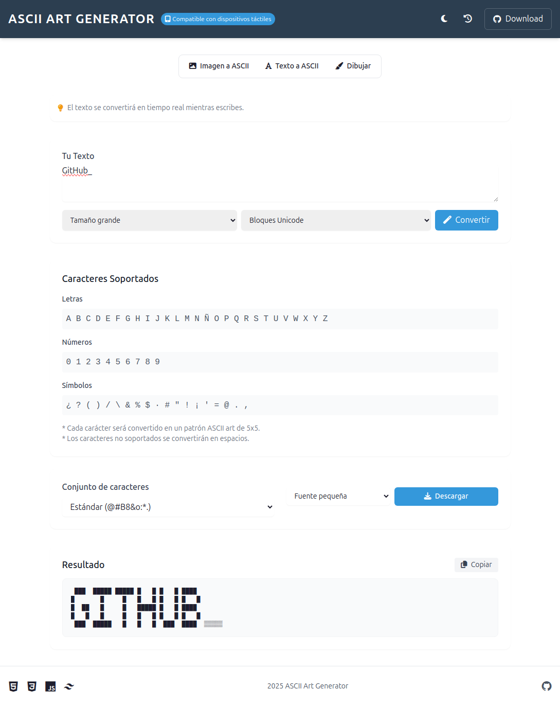
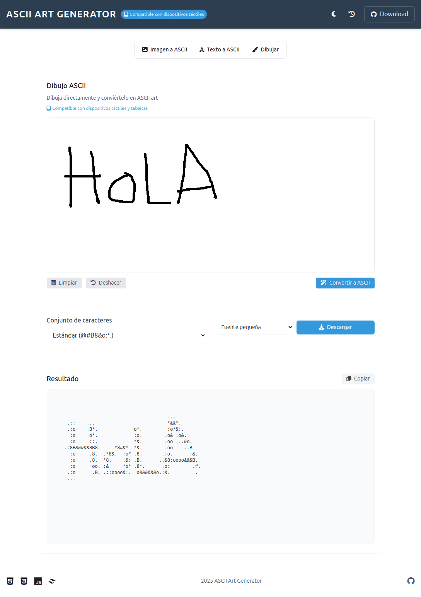

# 🎨 ASCII Art Generator 2.1

   

Un potente generador de arte ASCII modular y completo que convierte imágenes, texto y dibujos a arte ASCII. Arquitectura modular completamente refactorizada con JavaScript vanilla y Tailwind CSS, que ofrece una experiencia rica en funcionalidades con una interfaz limpia y responsive.

## 🖼️ Capturas de Pantalla

### Interfaz principal


### Conversión de texto


### Herramienta de dibujo


## ✨ Características Principales

### 🖼️ Conversión de Imagen a ASCII
- **Drop Zone** para arrastrar y soltar imágenes
- **Carga desde URL** para imágenes online
- **Controles avanzados**:
  - Ancho ajustable (50-300 caracteres)
  - Contraste (0.5-2.0)
  - Brillo (-50 a +50)
  - Opción para invertir colores
  - Salida a color (conserva los colores de la imagen original)
- **8 conjuntos de caracteres**:
  - Estándar `@#B8&o:*.`
  - Simple `#. `
  - Detallado (70+ caracteres)
  - Bloques Unicode `█▓▒░ `
  - Bloques Minimal `█▉▊▋▌▍▎▏ `
  - Estilo Matrix `01 `
  - Braille Unicode `⣿⣷⣯⣟⣿⣻⣽⣾ `
  - Personalizado (define tus propios caracteres)

### 📝 Conversión de Texto a ASCII
- Conversión en tiempo real
- Tres tamaños diferentes: pequeño, mediano y grande
- Amplio soporte para caracteres:
  - Letras (A-Z)
  - Números (0-9)
  - Símbolos especiales y puntuación

### 🖌️ Dibujo a ASCII - ¡NUEVO!
- **Canvas de dibujo interactivo**
- **Compatible con dispositivos táctiles y tabletas**
- Opciones para:
  - Deshacer el último trazo
  - Limpiar el lienzo
  - Convertir dibujo a ASCII art

### 🌓 Temas y Personalización - ¡NUEVO!
- **Cambio dinámico** entre tema claro y oscuro
- **Tamaño de fuente ajustable** para el resultado
- **Persistencia** de preferencias en localStorage

### 📋 Historial de Conversiones - ¡NUEVO!
- **Guarda automáticamente** tus conversiones
- **Restaura** conversiones anteriores con un clic
- **Gestión** completa del historial

### 📤 Exportación y Descarga
- **Copia** con un clic al portapapeles
- **Descarga** como archivo de texto (.txt)
- **Descarga** como imagen (.png) - ¡NUEVO!

## 🚀 Cómo Usar

### 🖼️ Conversión de Imagen
1. **Selecciona la pestaña "Imagen a ASCII"**
2. **Sube una imagen** (tres opciones):
   - Haz clic en "Subir Imagen"
   - Arrastra y suelta en la zona designada
   - Pega una URL de imagen en el campo correspondiente
3. **Personaliza** con los controles de ancho, contraste, brillo
4. **Selecciona** el conjunto de caracteres deseado
5. **¡Listo!** La imagen se convierte automáticamente

### 📝 Conversión de Texto
1. **Selecciona la pestaña "Texto a ASCII"**
2. **Escribe o pega** tu texto
3. **Elige** el tamaño del texto
4. **¡Listo!** El texto se convierte automáticamente en tiempo real

### 🖌️ Dibujo a ASCII
1. **Selecciona la pestaña "Dibujar a ASCII"**
2. **Dibuja** libremente en el canvas
3. **Haz clic en "Convertir"** para transformar tu dibujo en ASCII

### 📥 Exportación y Compartir
- Usa el botón **"Descargar"** para guardar como texto
- Usa el botón **"Descargar como Imagen"** para guardar como PNG
- Usa el botón **"Copiar"** para copiar al portapapeles
- Usa el botón **"Compartir"** para publicar en redes sociales

## 📂 Arquitectura Modular

El proyecto ha sido completamente refactorizado siguiendo principios de diseño modular y manteniendo cada archivo bajo 300 líneas de código.

### 🧩 Estructura de Módulos

- **`config.js`**: Configuración global y estado de la aplicación
  - Define namespaces, constantes y configuraciones
  - Mantiene el estado global de la aplicación
  - Gestiona los diccionarios de caracteres

- **`utils.js`**: Funciones de utilidad general
  - Sistema de notificaciones
  - Funciones para formateo de fecha/hora
  - Utilidades de debounce
  - Generación de IDs únicos

- **`image-converter.js`**: Conversión de imágenes a ASCII
  - Procesamiento de imagen a través de canvas
  - Manipulación de píxeles
  - Aplicación de contraste, brillo e inversión
  - Mapeo de colores a caracteres ASCII

- **`text-converter.js`**: Conversión de texto a ASCII
  - Definición de fuentes ASCII
  - Transformación de texto a arte ASCII
  - Soporte para diferentes tamaños

- **`drawing-manager.js`**: Funcionalidad de dibujo
  - Inicialización y configuración del canvas
  - Manejo de eventos de ratón y táctiles
  - Gestión del historial de trazos
  - Conversión de dibujos a imágenes para procesamiento

- **`history-manager.js`**: Gestión del historial
  - Almacenamiento de conversiones pasadas
  - Restauración de configuraciones y contenido
  - Persistencia usando localStorage

- **`ui-manager.js`**: Gestión de interfaz de usuario
  - Cambio entre pestañas
  - Gestión de temas (claro/oscuro)
  - Control de modales
  - Funcionalidad de compartir

- **`download-manager.js`**: Gestión de descargas
  - Descarga de arte ASCII como texto
  - Descarga como imagen PNG
  - Copia al portapapeles

- **`main.js`**: Coordinación principal
  - Inicialización de la aplicación
  - Configuración de eventos
  - Gestión de referencias DOM

## 🛠️ Tecnologías Utilizadas

- **HTML5** para estructura
- **JavaScript** (Vanilla) para funcionalidad
- **[Tailwind CSS](https://tailwindcss.com/)** para diseño
- **[Font Awesome](https://fontawesome.com/)** para iconografía
- **LocalStorage API** para persistencia de datos
- **Canvas API** para dibujo y procesamiento de imágenes
- **Clipboard API** para funcionalidad de copia

## 📦 Instalación

1. Clona el repositorio:
```bash
git clone https://github.com/686f6c61/ASCII-Art-Generator.git
```

2. Abre `index.html` en tu navegador favorito

¡Y eso es todo! No se requieren dependencias adicionales ni proceso de construcción. La arquitectura modular carga los scripts en el orden correcto sin necesidad de bundlers.

## 🔌 Compatibilidad

- **Navegadores modernos**: Chrome, Firefox, Edge, Safari
- **Dispositivos**: Funciona en escritorio, tabletas y móviles
- **Soporte táctil completo** para dibujo en dispositivos táctiles

## 🤝 Contribuir

Las contribuciones son bienvenidas. Para contribuir:

1. Fork el proyecto
2. Crea una rama para tu característica (`git checkout -b feature/NuevaFuncionalidad`)
3. Commit tus cambios (`git commit -m 'Añadir NuevaFuncionalidad'`)
4. Push a la rama (`git push origin feature/NuevaFuncionalidad`)
5. Abre un Pull Request

## 📄 Licencia

Este proyecto está bajo la Licencia MIT - ver el archivo [LICENSE](LICENSE) para más detalles.

## ⭐ Muestra tu apoyo

¡Dale una ⭐️ si este proyecto te ayudó!
